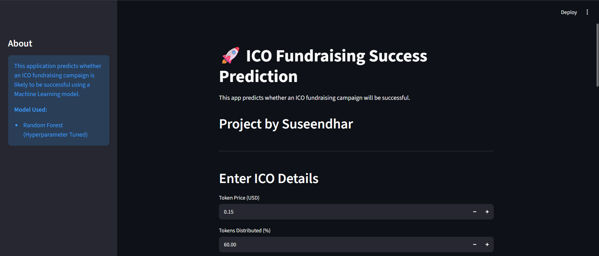
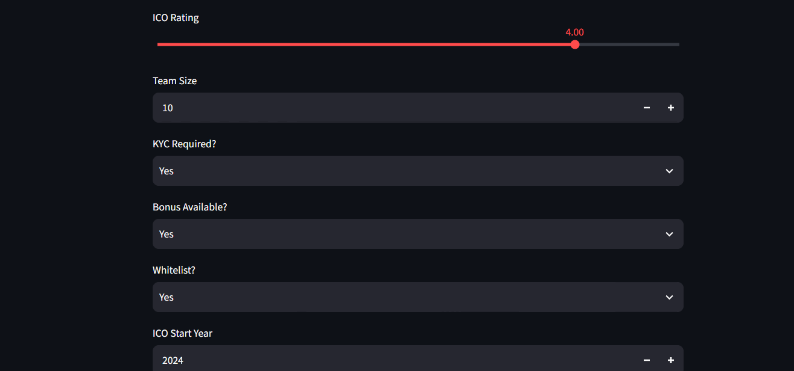
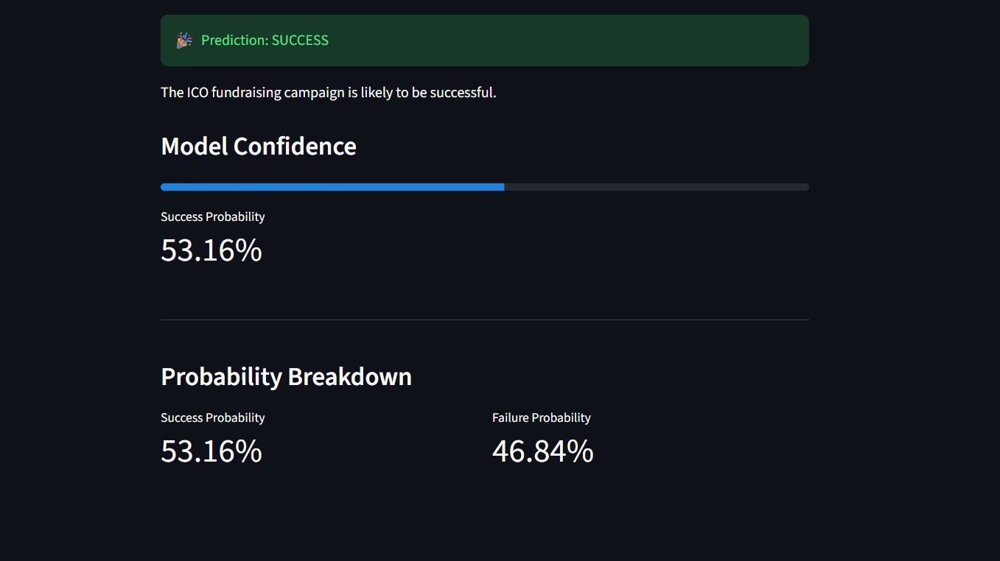
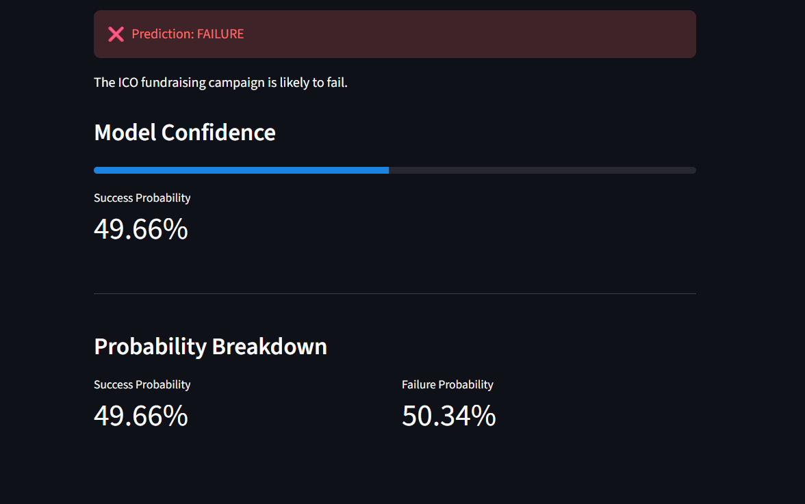

# 🚀 End-to-End ICO Fundraising Success Prediction

An end-to-end Machine Learning project that predicts whether an Initial Coin Offering (ICO) fundraising campaign is likely to achieve its fundraising target using historical campaign data and supervised machine learning.

---

## 📌 Project Overview

Initial Coin Offerings (ICOs) have become one of the most popular methods for blockchain startups to raise capital. However, many ICO campaigns fail to reach their fundraising goals, making it difficult for investors and project owners to evaluate potential success.

This project builds a complete Machine Learning pipeline to predict whether an ICO fundraising campaign will be successful based on its characteristics. The project includes data preprocessing, feature engineering, model training, hyperparameter tuning, evaluation, and deployment through a Streamlit web application.

---

## ✨ Features

- End-to-end Machine Learning workflow
- Data cleaning and preprocessing
- Feature engineering
- Exploratory Data Analysis (EDA)
- Multiple classification model comparison
- Hyperparameter tuning using RandomizedSearchCV
- Tuned Random Forest Classifier
- Interactive Streamlit web application
- Real-time prediction
- Prediction confidence score

---

## 📊 Model Performance

After comparing multiple classification algorithms, the **Hyperparameter Tuned Random Forest Classifier** was selected as the final model.

| Metric | Score |
|--------|------:|
| Accuracy | **76.37%** |
| Precision | **74.90%** |
| Recall | **46.48%** |
| F1 Score | **57.36%** |
| ROC-AUC | **79.92%** |

The model was optimized using **RandomizedSearchCV** and evaluated on a held-out test dataset.

---

## 🛠 Tech Stack

- Python
- Pandas
- NumPy
- Scikit-learn
- Streamlit
- Matplotlib
- Seaborn
- Joblib
- Jupyter Notebook

---

## 📁 Project Structure

```text
End-to-End-ICO-Fundraising-Success-Prediction/
│
├── app/                 # Streamlit application
├── data/                # Raw and processed datasets
├── models/              # Saved trained models
├── notebooks/           # Jupyter notebooks
├── reports/             # Reports and documentation
├── screenshots/         # Application screenshots
├── src/                 # Source code
├── requirements.txt     # Project dependencies
└── README.md            # Project documentation
```

---

## 🖥 Application Screenshots

### 🏠 Home Page



---

### 📝 Input Form



---

### ✅ Successful Prediction



---

### ❌ Failed Prediction



---

## ⚙ Installation

Clone the repository

```bash
git clone https://github.com/suseendharC/End-to-End-ICO-Fundraising-Success-Prediction.git
```

Navigate to the project

```bash
cd End-to-End-ICO-Fundraising-Success-Prediction
```

Install the required packages

```bash
pip install -r requirements.txt
```

---

## ▶️ Run the Application

Start the Streamlit application

```bash
streamlit run app/app.py
```

The application will open automatically in your browser.

---

## 📈 Machine Learning Workflow

1. Data Collection
2. Data Cleaning
3. Exploratory Data Analysis
4. Feature Engineering
5. Data Preprocessing
6. Model Training
7. Hyperparameter Tuning
8. Model Evaluation
9. Model Serialization
10. Streamlit Deployment

---

## 📌 Key Input Features

The prediction model uses several ICO-related attributes including:

- Token Price
- Tokens Distributed
- Tokens for Sale
- ICO Rating
- Team Size
- KYC Requirement
- Bonus Availability
- Whitelist Availability
- ICO Start Year
- ICO Start Month
- ICO End Year
- ICO End Month
- ICO Duration
- Country

---

## 👨‍💻 Author

**Suseendhar C**

GitHub: https://github.com/suseendharC

---

## ⭐ If you found this project useful, consider giving it a star on GitHub!